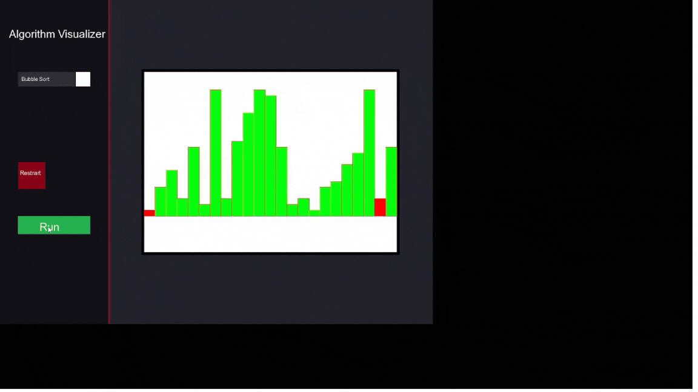

# Algorithm Visualizer

This project is a graphical visualization tool for various sorting algorithms, implemented using the **SFML (Simple and Fast Multimedia Library)** in C++. The tool allows users to visualize how different sorting algorithms work in real-time, with a user-friendly interface that includes buttons for starting the sorting process, resetting the data, and selecting different algorithms.

---

## Features

- **Sorting Algorithms**: Visualize three popular sorting algorithms:
  - **Bubble Sort**
  - **Selection Sort**
  - **Insertion Sort**

- **Interactive Interface**:
  - **Start Button**: Begins the sorting process for the selected algorithm.
  - **Reset Button**: Resets the dataset to its original state.
  - **Dropdown Menu**: Allows users to select which sorting algorithm to visualize.

- **Real-Time Visualization**: The sorting process is displayed in real-time, with color changes to indicate the elements being compared or swapped.

- **Customizable Dataset**: The dataset can be easily modified in the code to visualize different sets of numbers.

---

## How to Use

1. **Clone the Repository**:
   ```bash
   git clone https://github.com/NaciGokhanBasaran/algorithm-visualizer.git
   cd algorithm-visualizer
   ```

2. **Install Dependencies**:
   Ensure you have SFML installed on your system. You can download it from the [official SFML website](https://www.sfml-dev.org/download.php).

3. **Compile the Code**:
   Use a C++ compiler that supports C++11 or later. For example, using `g++`:
   ```bash
   g++ -std=c++11 main.cpp -o algorithm_visualizer -lsfml-graphics -lsfml-window -lsfml-system
   ```

4. **Run the Program**:
   ```bash
   ./algorithm_visualizer
   ```

5. **Interact with the Interface**:
   - Use the **Dropdown Menu** to select a sorting algorithm.
   - Click the **Start Button** to begin the visualization.
   - Click the **Reset Button** to reset the dataset to its original state.

---

## Code Structure

- **main.cpp**: The main file containing the implementation of the sorting algorithms and the SFML window setup.
- **SFML Graphics Library**: Used for rendering the graphical interface and visualizing the sorting process.

### Key Components

- **dropDownMenuItem**: A struct representing an item in the dropdown menu, containing the algorithm name and its graphical representation.
- **datarect**: A struct representing a data rectangle in the visualization, with properties like value, position, size, and color.
- **BubbleSort, SelectionSort, InsertionSort**: Functions that implement the respective sorting algorithms and update the visualization in real-time.
- **reset_dataSet**: A function that resets the dataset to its original state.

---

## Example Dataset

The default dataset used in the visualization is:
```cpp
std::vector<float> list = { 2, 5, 8, 3, 12, 1 };
```
You can modify this dataset in the `main()` function to visualize different sets of numbers.

---
## Gif


## Video
<a href="https://www.youtube.com/watch?v=hBIMvmKBYys">
  
</a>
---

## Contributing

Contributions are welcome! If you have any suggestions, bug reports, or feature requests, please open an issue or submit a pull request.

---

## License

This project is licensed under the MIT License. See the [LICENSE](LICENSE) file for more details.

---


- **SFML**: For providing a simple and efficient library for multimedia applications.
- **Sorting Algorithms**: For being the foundation of this visualization tool.

---

Enjoy visualizing sorting algorithms with this tool! If you find it useful, consider giving it a ⭐ on GitHub!
